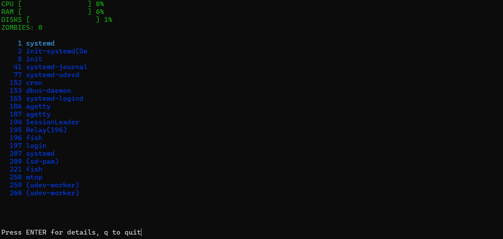

# mtop
top-utility for Linux, compiled on musl-libraries

## mtop features
- SMALL! mtop size it's ~300 KB.

- CROSS-PLATFORM! Works anywhere Linux and TERMINFO are available.

## Tested systems
It's tested on Debian and Alpine distributions.

## mtop screenshot

## How to build?
Type "musl-gcc -static src/main.c -o bin/mtop" to build mtop.
